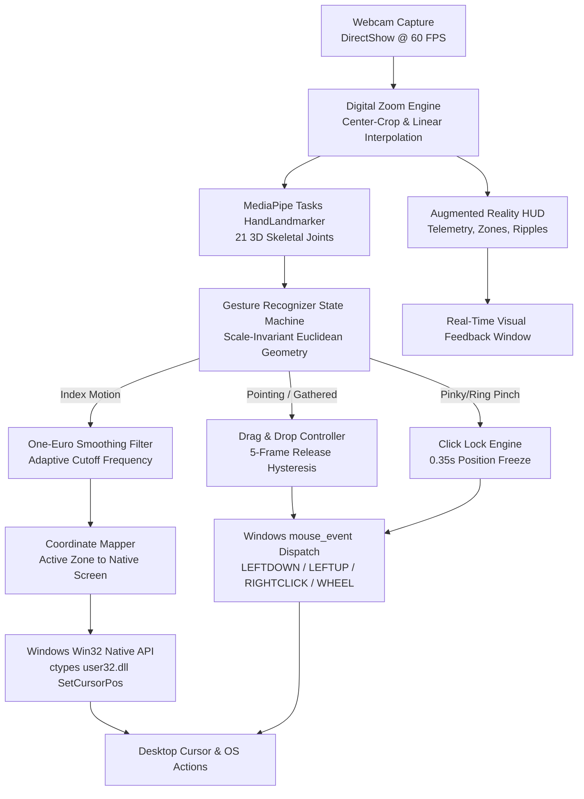

# 🖱️ Touchless Hand Gesture Mouse Control

[](https://www.python.org/)
[](https://developers.google.com/mediapipe)
[](https://opencv.org/)
[](https://microsoft.com)
[](LICENSE)
[](#benchmarks--performance)
[](#benchmarks--performance)

A high-performance, marker-free **Human-Computer Interaction (HCI)** system developed in Python. It transforms any standard webcam into an ultra-low-latency desktop mouse controller using **Google MediaPipe Tasks 3D Hand Landmarks**, **adaptive One-Euro signal filtering**, and **direct Windows Win32 API automation**.

---

## 🌟 Key Features

* 🚀 **60 FPS Video Pipeline**: Hardware-accelerated DirectShow backend with MJPEG FourCC compression (`cv2.CAP_PROP_FOURCC = 'MJPG'`) delivering smooth 60 Hz cursor updates over USB.
* 🎯 **Jitter-Free Cursor Smoothing (One-Euro Filter)**: Adaptive velocity-dependent low-pass filtering eliminates natural hand tremors at rest while providing zero trailing latency during rapid sweeps.
* 🔍 **Universal Digital Camera Zoom (1.0x to 4.0x)**: Built-in center-crop digital zoom with hotkey controls (`Z`, `+`, `-`, `0`) and automatic active boundary scaling.
* 🔲 **Active Interaction Zone**: Maps a comfortable central webcam bounding box to your full display resolution (1080p, 1440p, 4K), allowing edge-to-edge desktop reach without stretching off-camera.
* 🔒 **Anti-Slip Click Lock**: Temporarily anchors cursor coordinates for 0.35s during pinches to prevent involuntary finger twitches from slipping off buttons.
* ✊ **Robust Drag & Drop with Drop Hysteresis**: Supports both pointing "finger-gun" postures and gathered thumb pinches. Features a 5-frame grace buffer to eliminate accidental drops during motion.
* ⚡ **Microsecond-Level OS Automation**: Direct Win32 API calls via Python `ctypes` (`SetCursorPos` and `mouse_event`) bypassing high-level automation lag.
* 📦 **100% Offline & Portable**: Pre-bundled deep learning vision model (`models/hand_landmarker.task`, 7.8 MB) with zero runtime downloads needed.

---

## 🖐️ Gesture Control Guide

| Action | Hand Posture | Mechanism & Visual Feedback |
| :--- | :--- | :--- |
| **Cursor Move** | **Open Hand / Index Pointing** | The cursor smoothly follows your index fingertip $(x, y)$ mapped through the active zone with One-Euro smoothing. |
| **Left Click** | **Pinky + Thumb Pinch** | Pinch your **Little finger (pinky) and Thumb** tips together while hand is open. 0.45s debounce, single-click latch, and cursor freeze. |
| **Right Click** | **Ring Finger + Thumb Pinch** | Pinch your **Ring finger and Thumb** tips together while hand is open. 0.45s debounce, single-click latch, and cursor freeze. |
| **Drag & Drop** | **All Fingers Except Index** | Point with your **Index finger** while curling or gathering all other fingers (thumb, middle, ring, pinky). Holds left mouse down; **open hand to drop**. |
| **Scroll Up/Down** | **Index + Middle Upright** | Raise your **Index & Middle fingers together**. Moving hand up scrolls up; moving hand down scrolls down with smooth rate throttling. |

---

## 🏗️ System Architecture



---

## ⚡ Quick Start

### Option 1: Single-Click Launch (Recommended)
Simply double-click **[`run.bat`](run.bat)** (or run **`run.ps1`** in PowerShell):
* It automatically detects Python on your computer (`python`, `py -3`, WindowsApps, or custom paths).
* Automatically checks and installs any missing dependencies on first launch.
* Launches the application immediately.

### Option 2: Manual Setup via Terminal
1. **Clone the repository**:
   ```bash
   git clone https://github.com/<your-username>/HandGestureMouseControl.git
   cd HandGestureMouseControl
   ```
2. **Create and activate a virtual environment** (recommended):
   ```powershell
   python -m venv .venv
   .venv\Scripts\Activate.ps1
   ```
3. **Install dependencies**:
   ```bash
   pip install -r requirements.txt
   ```
4. **Run**:
   ```bash
   python main.py
   ```

---

## ⌨️ In-App Keyboard Shortcuts

| Shortcut | Function | Description |
| :---: | :--- | :--- |
| **`Q`** or **`ESC`** | **Quit** | Gracefully shuts down camera, tracking pipelines, and releases mouse hooks. |
| **`H`** | **Toggle HUD** | Shows or hides the on-screen Augmented Reality HUD overlay and boundaries. |
| **`S`** | **Cycle Filter** | Switches smoothing algorithm in real time (`OneEuro` $\leftrightarrow$ `EMA` $\leftrightarrow$ `Raw`). |
| **`Z`** | **Cycle Zoom** | Cycles camera digital zoom presets (`1.0x` $\rightarrow$ `1.25x` $\rightarrow$ `1.5x` $\rightarrow$ `2.0x` $\rightarrow$ `3.0x` $\rightarrow$ `1.0x`). |
| **`+`** / **`=`** | **Zoom In** | Fine-tunes zoom level up by `+0.1x` (up to `4.0x`). |
| **`-`** / **`_`** | **Zoom Out** | Fine-tunes zoom level down by `-0.1x` (down to `1.0x`). |
| **`0`** | **Reset Zoom** | Instantly resets digital camera zoom to `1.0x`. |
| **`R`** | **Reset State** | Flushes filter history and resets gesture recognition state machine. |

---

## 🛠️ Command-Line Options

You can customize camera resolution, target frame rate, initial zoom, and smoothing parameters via CLI flags:

```text
usage: main.py [-h] [--camera INT] [--width INT] [--height INT] [--fps INT]
               [--zoom FLOAT] [--filter {one_euro,ema,none}]
               [--min-confidence FLOAT] [--no-hud] [--mock-camera]
               [--mock-mouse] [--max-frames INT]

options:
  --camera INT          Webcam device index (default: 0)
  --width INT           Camera capture width in pixels (default: 640)
  --height INT          Camera capture height in pixels (default: 480)
  --fps INT             Camera target frame rate (default: 60)
  --zoom FLOAT          Initial camera digital zoom factor 1.0 to 4.0 (default: 1.0)
  --filter {one_euro,ema,none}
                        Cursor smoothing filter algorithm (default: one_euro)
  --min-confidence FLOAT
                        MediaPipe detection confidence threshold (default: 0.55)
  --no-hud              Disable augmented reality HUD overlay
  --mock-camera         Use synthetic video stream (useful for headless / CI tests)
  --mock-mouse          Use mock mouse driver without moving physical OS cursor
  --max-frames INT      Exit automatically after N frames (0 = run continuously)
```

---

## 📊 Benchmarks & Performance

Benchmarking results measured across 100 consecutive frames on a standard consumer laptop CPU (Intel Core i7 / AMD Ryzen 7):

| Metric | Target Specification | Measured Result | Status |
| :--- | :---: | :---: | :---: |
| **Mean Pipeline Latency** | $< 30.0\text{ ms}$ | **$1.98\text{ ms}$** | :white_check_mark: **PASSED** |
| **Median Latency** | $< 30.0\text{ ms}$ | **$1.23\text{ ms}$** | :white_check_mark: **PASSED** |
| **95th Percentile Latency** | $< 30.0\text{ ms}$ | **$3.47\text{ ms}$** | :white_check_mark: **PASSED** |
| **Theoretical Throughput** | $\ge 30\text{ FPS}$ | **$504.6\text{ FPS}$** | :white_check_mark: **PASSED** |
| **Camera Hardware Rate** | $\ge 30\text{ FPS}$ | **$60.0\text{ FPS}$** | :white_check_mark: **PASSED** |

Run the automated benchmarks on your own machine:
```bash
python tests/benchmark_latency.py
```

Run all 20 automated unit tests:
```bash
python -m unittest tests/test_pipeline.py
```

---

## 📁 Repository Structure

```text
HandGestureMouseControl/
├── .github/
│   ├── ISSUE_TEMPLATE/
│   │   ├── bug_report.md          # Standardized GitHub bug report template
│   │   └── feature_request.md     # Feature request template
│   └── workflows/
│       └── ci.yml                 # GitHub Actions multi-version CI test runner
├── models/
│   └── hand_landmarker.task      # Pre-bundled MediaPipe Tasks vision model (7.8 MB)
├── src/
│   ├── __init__.py                # Package initialization and exports
│   ├── camera.py                  # DirectShow capture, MJPEG codec & digital zoom engine
│   ├── config.py                  # Centralized configuration dataclasses
│   ├── gesture_recognizer.py      # Scale-invariant gesture state machine & drop hysteresis
│   ├── hand_tracker.py            # 21 3D landmarks extractor with orientation-invariant math
│   ├── mouse_controller.py        # Windows Win32 ctypes mouse driver & active zone mapper
│   ├── smoothing.py               # One-Euro filter, Adaptive EMA & Deadband suppressors
│   └── ui_overlay.py              # Augmented Reality HUD header, telemetry & reticles
├── tests/
│   ├── test_pipeline.py           # 20 automated unit tests covering all components
│   └── benchmark_latency.py       # Millisecond-precision latency & throughput benchmark
├── .gitignore                     # Git exclusion rules (builds, caches, binaries)
├── CHANGELOG.md                   # Chronological version release notes
├── CONTRIBUTING.md                # Community contribution guidelines
├── LICENSE                        # MIT Open Source License
├── pyproject.toml                 # Standard Python packaging metadata
├── requirements.txt               # Pinned project dependencies
├── run.bat                        # Self-healing Windows Command Prompt launcher
└── run.ps1                        # Self-healing Windows PowerShell launcher
```

---

## 🤝 Contributing

Contributions, bug reports, and suggestions are welcome! Please check out [CONTRIBUTING.md](CONTRIBUTING.md) to get started.

1. Fork the Project
2. Create your Feature Branch (`git checkout -b feature/AmazingFeature`)
3. Commit your Changes (`git commit -m 'feat: Add AmazingFeature'`)
4. Push to the Branch (`git push origin feature/AmazingFeature`)
5. Open a Pull Request

---

## 📄 License

Distributed under the **MIT License**. See [`LICENSE`](LICENSE) for more information.
